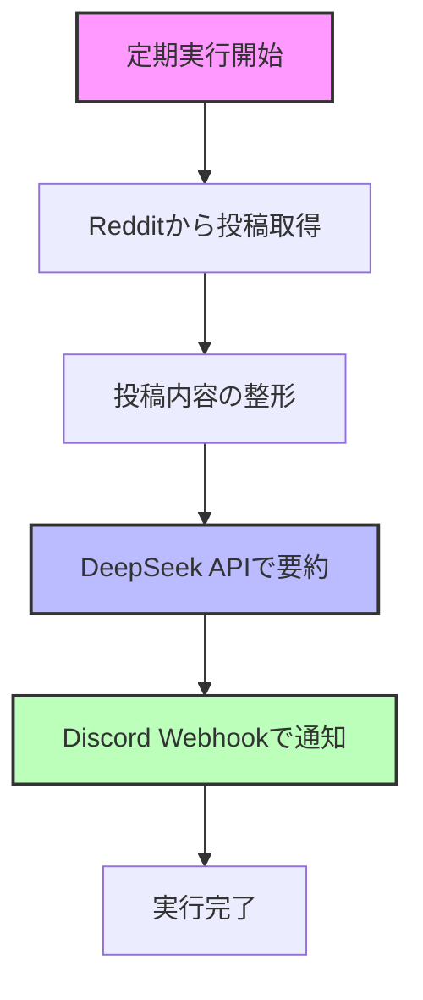

# システムフロー図

## 基本フロー

```mermaid
graph TD
    A[定期実行開始] --> B[Redditから投稿取得]
    B --> C[投稿内容の整形]
    C --> D[DeepSeek APIで要約]
    D --> E[Discord Webhookで通知]
    E --> F[実行完了]

    style A fill:#f9f,stroke:#333,stroke-width:2px
    style D fill:#bbf,stroke:#333,stroke-width:2px
    style E fill:#bfb,stroke:#333,stroke-width:2px
```